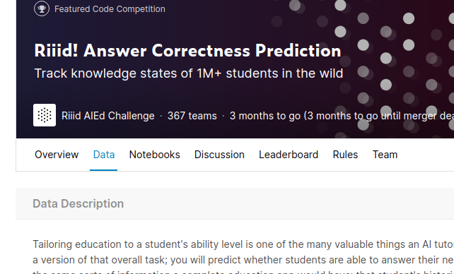
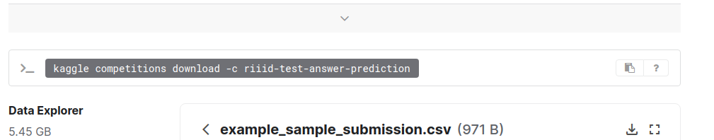

# kaggle-to-drive
Download Kaggle datasets directly to your drive using Colab
## Steps to follow
#### step 1 : Get your kaggle API token
* LogIn to kaggle.com
* Go to My Account section
* Scroll Down and find API section
* Now click on Create New API token and this will download a json file
* We will use the info from json file to download datasets

#### Step 2: Get the kaggle dataset API to download
* Go to the dataset or competition whose data you want to download
</img>
* Go to data Section and copy the API command to download dataset
</img>
* save this command, we will use this next.

#### Step 3: Open the notebook in colab and Run the cell and just provide the information 
<strong>information required:</strong>
1. Username(from json file)
2. key(from json file)
3. location of project where you want to save data
4. kaggle download data api
